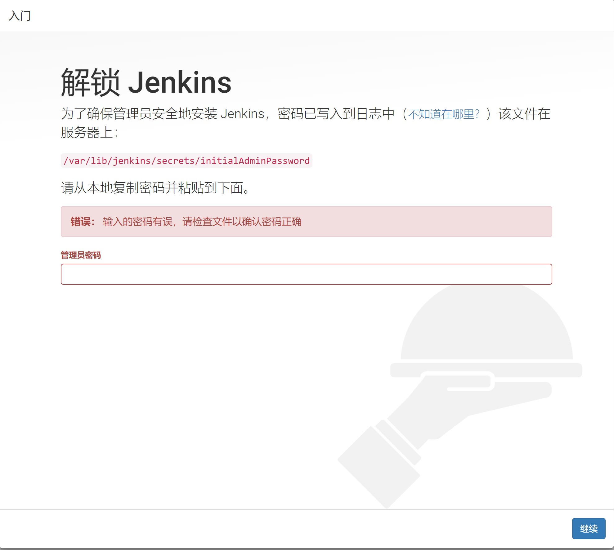
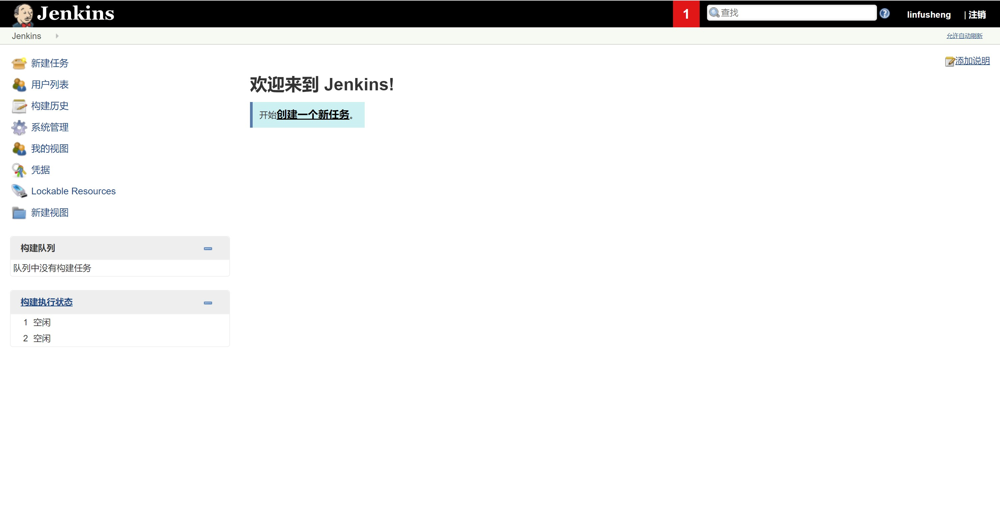

# CI环境搭建-Jenkins 安装

## Jenkins 简介

Jenkins是一个独立的开源自动化服务器，可用于自动化各种任务，如构建，测试和部署软件

## Jenkins安装

### 安装环境  
    CentOs7.3

### 最小配置要求
    Java 8  
    256MB可用内存  
    1GB +可用磁盘空间

### 安装步骤
#### (1) 下载相关依赖  
    sudo wget -O /etc/yum.repos.d/jenkins.repo https://pkg.jenkins.io/redhat-stable/jenkins.repo
#### (2) 导入密钥
    sudo rpm --import https://pkg.jenkins.io/redhat-stable/jenkins.io.key
#### (3) 安装Jenkins
    yum install jenkins

## Jenkins 配置

### 端口配置
    # /etc/sysconfig/jenkins 是 Jenkins 的配置文件
    vim /etc/sysconfig/jenkins
    
    #寻找端口配置项
    /JENKINS_PORT

    #设置端口号，确保端口号不被其它进程占用
    JENKINS_PORT = PORT_NUMBER

## Jenkins 启动
    java -jar /usr/lib/jenkins/jenkins.war --httpPort=8080
## 安装向导
Jenkins 在首次运行时，会生成安全令牌，并将其打印在控制台中，以及保存在服务器的/var/lib/jenkins/secrets/initialAdminPassword文件中。在首次访问 Jenkins 时，必须在安装向导中提供此令牌才能继续。   
在安装向导中选择使用社区建议安装插件，插件安装结束后会进入用户创建页面，在该页面进行用户创建。 
在“安装向导在安装向导中如果跳过用户创建步骤，该密钥即为 admin 的默认密码。  
至此 Jenkins 安装完毕。
  

## 参考
https://www.w3cschool.cn/jenkins/jenkins-79ex28jh.html  
https://www.jianshu.com/p/180fb11a5b96

    

