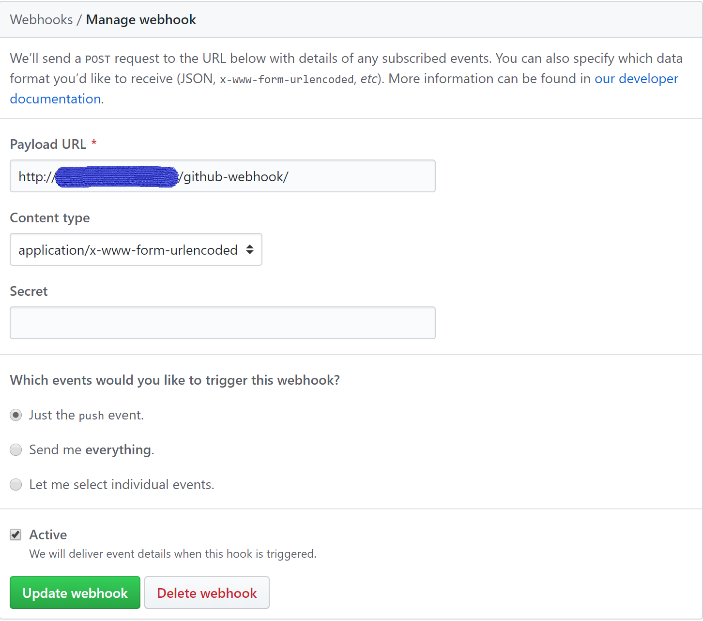
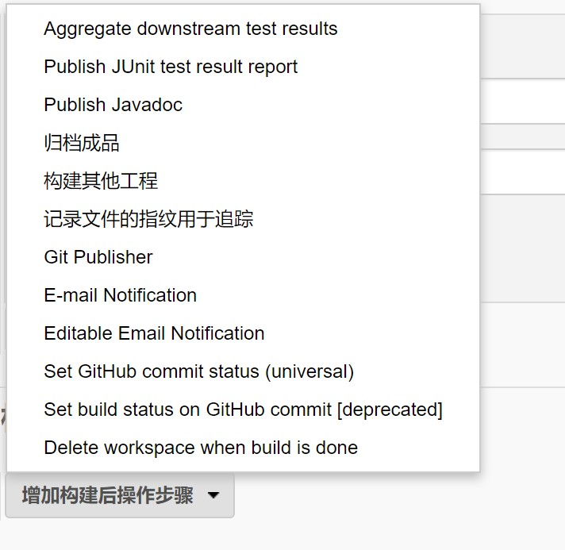

# CI 环境搭建-JenKins 集成 GitHub

## Github 配置
Jenkins 集成 GitHub 借助的 Github 的 webhook 机制，GitHub 的 webhook 能够在 push 之后向 Jenkins 服务器 post 一条消息，从而触发 JenKins 中预设的任务。因此我们要在 GitHub 中配置 webhook。
#### Personal Access Token 生成
Personal Access Token(PAT) 是用来给 API 的进行授权验证的 Token, 也可以代替 git over https 的密码。 生成 PAT 要在 GitHub 的全局 settings 中生成，其具体路径为 ```settings -> Developer settings -> Personal Access Tokens```, 选择生成新的 Token.在生成界面的 Select scopes 项勾选 repo 和 admin:repo_hook。生成后要注意保存好该 Token, 丢失就只能再生成新的 Token 了

#### GitHub webhooks 设置
webhook 的配置是在具体的项目仓库中进行配置的，其配置的路径为 ``` 某一仓库 -> Settings -> Webhooks```, 选择添加 webhook, 在 Payload URL 中填写 ```http://你的 Jenkins 服务器的 url/github-webhook/``` 

## Jenkins 中的配置与任务创建
由于我们在安装 Jenkins 时采用的社区建议方式安装，因此大部分常用的 plugin 已经安装完毕。
### Jenkins 中的 GitHub 配置
#### 添加 GitHub 服务器
进入 ``` 系统管理 -> 系统设置 -> 添加 GitHub 服务器 ```, 在下图名称中输入GitHub 服务器的名称， API/URL 按照图中地址填写，在凭据中选择添加

#### 添加凭据
在添加凭据时， 凭据类型选择 ```Secret text```, 在 Secret 中填入在 GitHub 中s生成的 Personal Access Token。可在 描述一栏中填写对该凭据的描述。


### 在 Jenkins 中创建构建任务

在本节中将以构建一个 maven 项目的为例，展示如何新建一个构建任务。

#### maven 环境配置
maven 构建任务需要对 maven 进行配置， 首先需要在 Jenkins 服务器上安装 maven, 然后在 ```系统管理 -> 全局工具配置``` 中的 ```maven 配置``` 项进行配置, 将默认的 settings 提供均修改为```文件系统中的 settings 文件```，然后在文件路径中填写 settings 文件在服务器上的路径

然后在 ```Maven``` 配置项中新增 Maven, 并将服务器中 Maven 主目录的路径填入 ```MAVEN_HOME``` 中


#### 新建构建任务

在 Jenkins 导航栏中选择 ```新建任务-> 构建一个自由风格的软件项目```, ，然后对该任务进行配置，
##### General 配置
在 ```General``` 配置项中勾选 ```GitHub``` 项, 并将目标项目的 GitHub URL 填写进 ```项目 URL``` 中 

##### 源码管理配置
在```源码管理```中勾选 ```git```, 然后填写仓库的地址和证书，然后填写需要构建的分支，```源码库浏览器``` 选择 ```githubweb```， 然后再 URL 中填入项目的 GitHub 地址

##### 构建触发器配置
构建触发器能够在特定条件下触发构建任务，在这里我们配置成只要 GitHub 仓库中有新的提交就进行构建任务。因此勾选```GitHub hook trigger for GITSCm polling```

##### 构建环境配置与绑定配置
构建环境我们选择 ```Use secret text(s) or file(s)``` , 在绑定中使用指定凭据，即 Personal Access Token

##### 构建配置
在进行 maven 项目构建任务时，我们在```增加构建步骤```中选择```调用顶层 Maven 目标```， 这里需要注意的是```增加构建步骤```中的每一项都是一个步骤，我们可以按照自己的需求选择不同的选项先后执行不同的构建步骤, 然后我们在 Maven 构建步骤中选择 Maven 版本，并在目标中填入要进行的 Maven 操作。


##### 构建后操作配置
在构建成功后，可以执行不同的操作，我们可以按照自身需求配置不同的操作


##参考
https://github.com/muyinchen/woker/blob/master/%E9%9B%86%E6%88%90%E6%B5%8B%E8%AF%95%E7%8E%AF%E5%A2%83%E6%90%AD%E5%BB%BA/%E6%89%8B%E6%8A%8A%E6%89%8B%E6%95%99%E4%BD%A0%E6%90%AD%E5%BB%BAJenkins+Github%E6%8C%81%E7%BB%AD%E9%9B%86%E6%88%90%E7%8E%AF%E5%A2%83.md