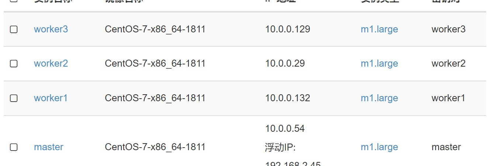

# K8s 集群部署

## 部署环境
本次部署环境使用课程提供的 OpenStack 资源，使用 OpenStack 资源一共创建了四台主机：

所有主机的配置均为：

 CPU | 内存 | 存储 
---- | ---- |----
   4 |    8G| 80GB

## 部署方式

虽然课程在内网环境中提供了 k8s 的离线安装包及其脚本，通过修改 cluster.yml 及运行其脚本可以成功安装 k8s 集群，但是在此部署方法下，k8s 的 dashboard 不能访问成功（非证书问题），浏览器访问 k8s 的 dashboard一直处于加载阶段，原因不明，因此本文另寻出路，参考简书作者[老菜_misa的文章](https://www.jianshu.com/p/0e1a3412528e)在 centos 中部署 k8s 集群。 部署过程中主要是镜像的访问问题，作者提供了百度云盘，从作者提供的云盘拿到镜像后就可以成功部署 k8s 集群了

## 应用部署

在应用部署中，k8s的依据官方文档，我们需要部署后端 deployment 及 service, 我们通过 yaml 文件部署这两个部分
yaml:
```
apiVersion: apps/v1beta1
kind: Deployment
metadata:
  name: eurake
spec:
  replicas: 1
  template:
    metadata:
      labels:
        app: eurake
        tier: backend
        track: stable
    spec:
      containers:
        - name: eurake
          image: "10.0.0.54:30451/library/eurakedemo:latest"
          ports:
            - name: http
              containerPort: 8888
---
kind: Service
apiVersion: v1
metadata:
  name: eurake
spec:
  selector:
    app: eurake
    tier: backend
  ports:
  - protocol: TCP
    port: 8888
    targetPort: http
```

在配置文件中配置 image 的地址，然后配置相关的端口，最后运行命令
```
kubectl apply -f xxx.yaml 
```
至此，应用部署完毕


