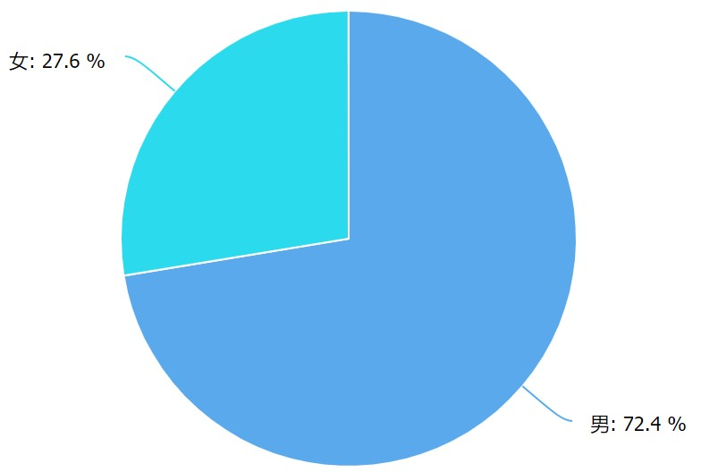
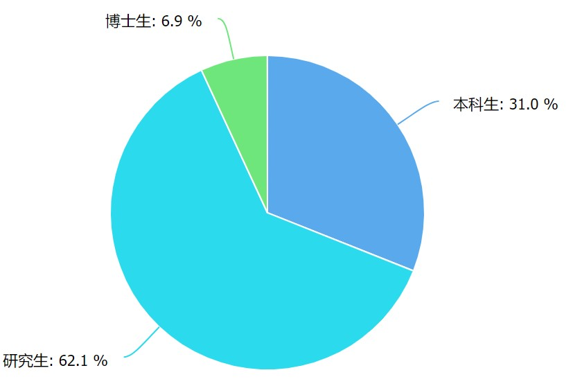
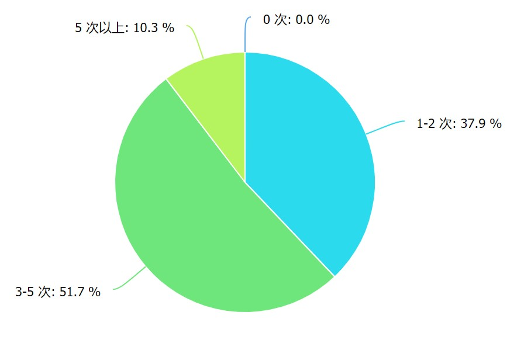
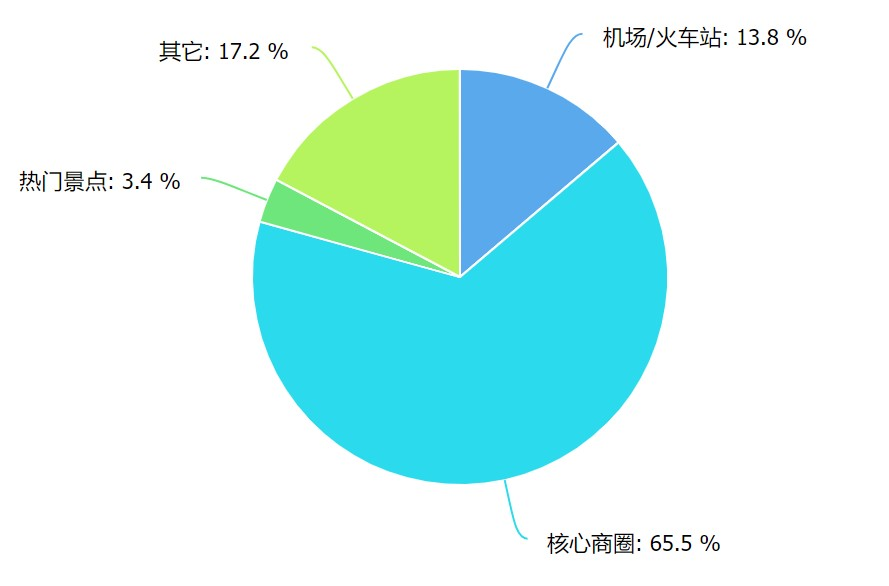
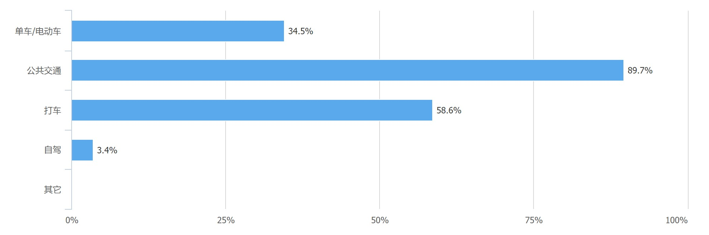
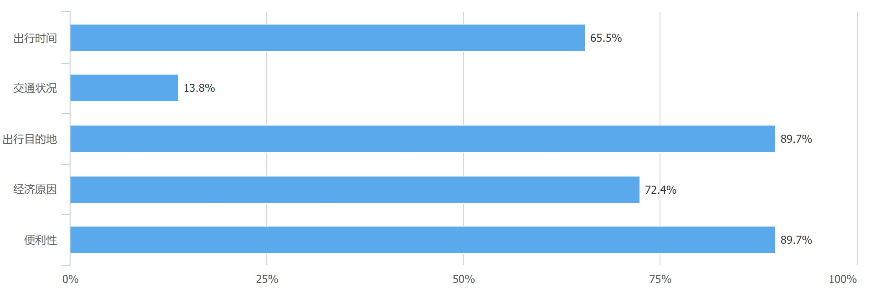
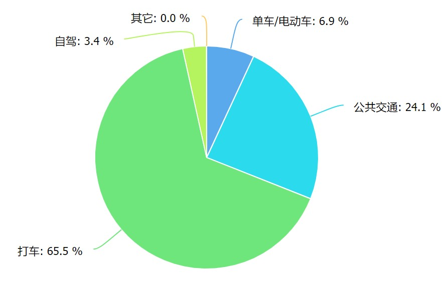

# 用户发现

### 1. 问卷内容
https://wj.qq.com/s2/3582505/02cc

### 2. 调查结果

#### QA1: 
参与本次问卷调查的男女比例大致为 7 ：3

#### QA2:
参与本次调查的研究生居多，这是由社交圈子影响的 

#### QA3:
在填写问卷调查的人群中，大多数人的出行频率在一周3-5次之间，其次是1-2次之间，大家的出行次数还是蛮多的。

#### QA4:
在常去目的中，核心商圈占了65.5%，大家出行的主要目的还是外出购物游玩。

#### QA5:
在出行方式中，大多数人的出行方式都是公共交通出行，还有超过一半的人会选择打车这一出行方式，少部分人选择自驾出行。

#### QA6:
在影响出行方式的原因中，便利性和出行目的地是影响出行方式的主要因素，其次经济因素也是出行方式的考虑因素之一，再者就是出行时间也对出行方式的选择造成了相应的影响。

#### QA7:
在遇到问题最多的出行方式中，大多数人在打车中遇到的问题是最多的，然后是在公共交通出行方式中。

### 结果分析
通过以上的调查结果显示，在学生这个群体中，人均周出行频率在 3-5 次之间，出行的次数频繁，其次出行的目的地通常是商圈之类的购物，游玩的地点，学生中休闲娱乐的需求较高，在出行方式中大多人选择公共交通出行，他们的选择方式受到出行目的地，便利性，经济原因的影响比较多。在影响出行方式中，大多数人在打车时会碰到较多的问题，可以针对这一点进行深入调研，以解决学生群体在出行中遇到的问题。